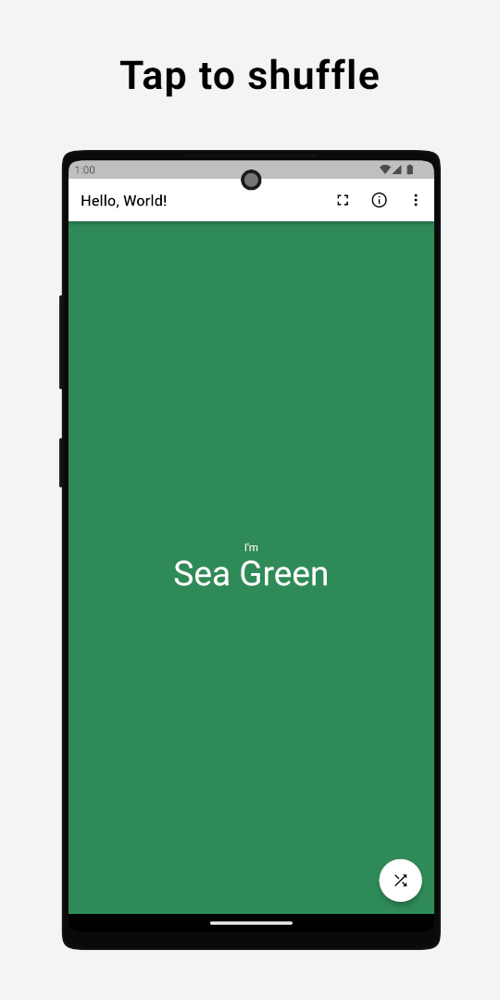
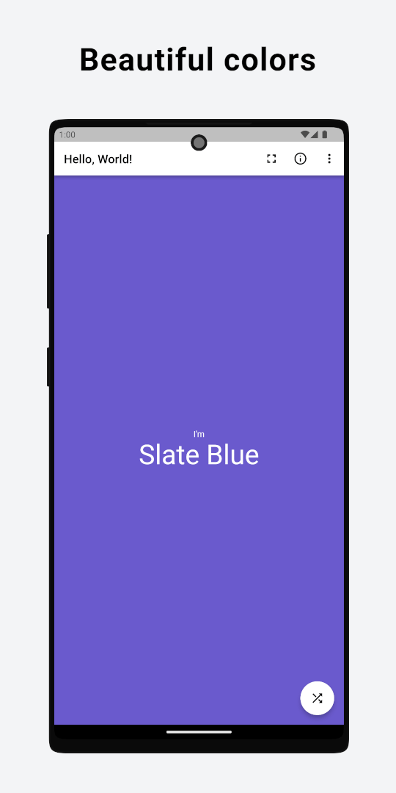
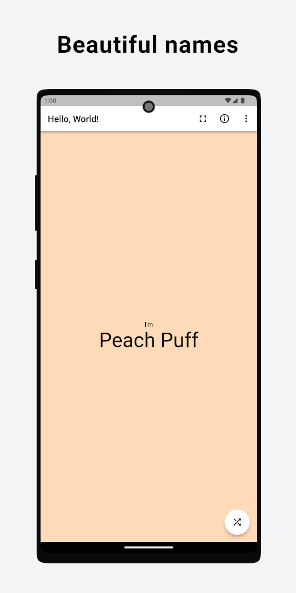
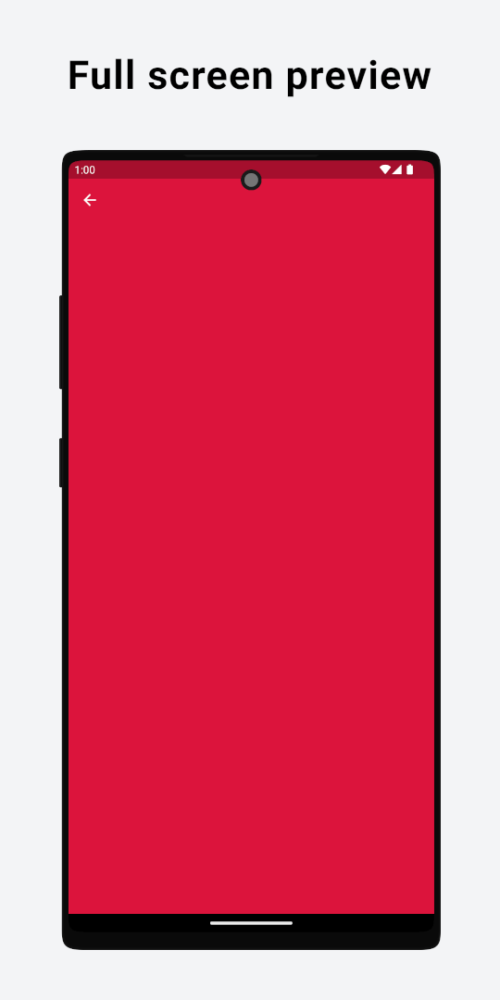
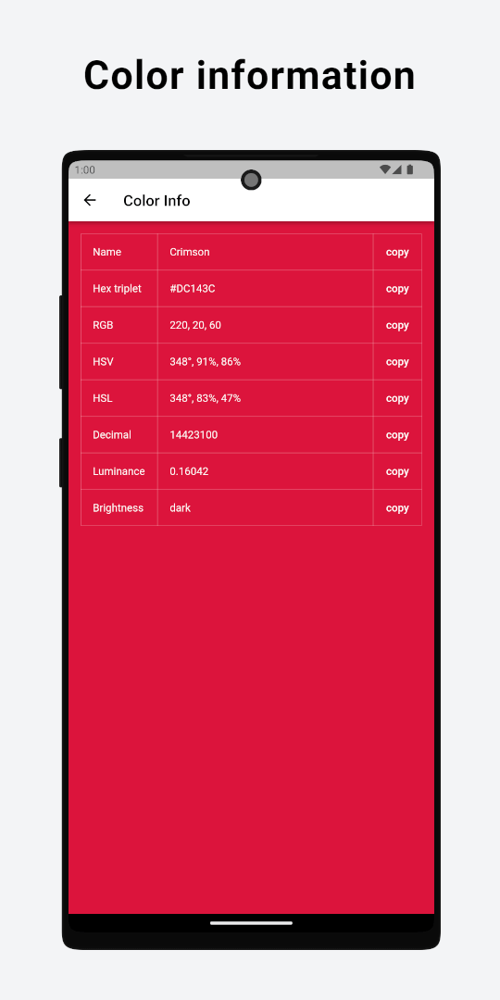

# Hello World Colors

[](https://flutter.dev/)

[](https://github.com/TechAurelian/hello_world_colors/actions/workflows/build-flutter-web.yml)
[](https://github.com/TechAurelian/hello_world_colors)
[](https://github.com/TechAurelian/hello_world_colors/commits/main)
[](https://github.com/TechAurelian/hello_world_colors/blob/main/LICENSE)

Slate Blue. Crimson. Peach Puff. A beautiful color with a beautiful name with every shuffle! A free and open-source Hello World app made with Flutter.

Hello World Colors lets you play with beautiful colors. Simply tap the Shuffle button and watch surprising random colors fill your phone or tablet.

There is also a clean color preview screen where you can view colors in all their splendor and a detailed color information screen where you can view detailed color codes and information, ready to copy and reuse.

Use Hello World Colors to discover beautiful colors, relax your eyes, and soothe your mind.

## Screenshots

<p>
  
  
  
  
  
</p>

## How to Run the App

<table>
  <tr>
    <td rowspan="2"><b>On Android</b></td>
    <td>
      <a href="https://play.google.com/store/apps/details?id=com.thehellomaker.heyworldcolors" target="_blank">
        
      </a>
    </td>
  </tr>
  <tr>
    <td>
      <a href="https://github.com/TechAurelian/hello_world_colors/releases" target="_blank">Download APK from GitHub Releases</a>
    </td>    
  </tr>
  <tr>
    <td><b>On any platform</b><br>(Android, ChromeOS, iOS,<br>Linux, macOS, Windows, etc.)</td>
    <td colspan="2">
      <a href="https://helloworldcolors.techaurelian.com" target="_blank">Run the web app in your browser</a>
    </td>
  </tr>
</table>

## Hello World

I'm learning Flutter, and this is one of my first Hello World Flutter apps.

Hello World apps are pretty famous, even if all they usually do is write "Hello, World!" on the screen. When learning a new programming language or platform, starting with such a simple program has become a tradition.

[Flutter](https://flutter.dev/) is a UI toolkit for crafting beautiful, natively compiled applications for mobile, web, and desktop from a single codebase.

**Building a user interface with Flutter is so easy and productive that even a Hello World app can have multiple screens, menu items, buttons, and actions instead of just writing "Hello, World!" on the screen!**

## Getting Started

1. If you don't have the Flutter SDK installed, please visit the official [Flutter](https://docs.flutter.dev/get-started/install) website.

2. Fetch the latest source code from the main branch.

``` 
git clone https://github.com/TechAurelian/hello_world_colors.git
```

3. Run the app with Visual Studio Code or Android Studio. Or the command line.

``` 
flutter pub get
flutter run
```

## Built With

- [Flutter](https://flutter.dev/) - Build apps for any screen.
- [Visual Studio Code](https://code.visualstudio.com/) - Code editing. Redefined.
- [share_plus](https://pub.dev/packages/share_plus) - A Flutter plugin to share content from your Flutter app.
- [url_launcher](https://pub.dev/packages/url_launcher) - A Flutter plugin for launching a URL.
- [GitHub Pages](https://pages.github.com/) - Websites for you and your projects, hosted directly from your GitHub repository.

## Contribute

If you have an issue or found a bug, please raise a GitHub issue [here](https://github.com/TechAurelian/hello_world_colors/issues). Pull requests are also welcome.

## License

Hello World Colors is licensed under the [MIT license](LICENSE).
